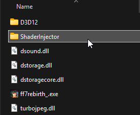
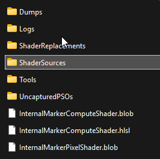
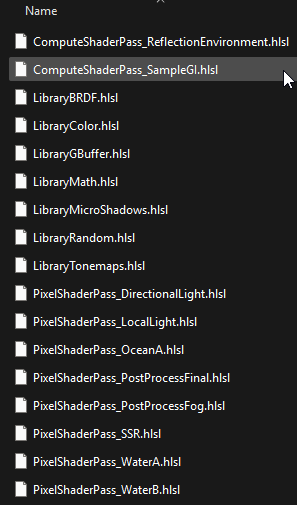

# Configuration Guide

#### Contents

- [Maximum Visual Quality Configuration](#maximum-visual-quality-configuration)
    - [SSGI / AO](#ssgi--ao)
    - [Auto Exposure](#auto-exposure)
    - [Tonemapping](#tonemapping)
    - [Bloom](#bloom)
- [Other Configuration Notes](#other-configuration-notes)
    - [Image Adjustments](#image-adjustments)

*NOTE: This was written at the release of 2.0, with newer updates this might become more out of date but the general principles are the same.*

With the release of 2.0 it comes with a whole suite of new shaders and features that drastically improve the lighting quality of the game! **However...**

**Some of the features and effects that are featured in screenshots or videos that you might have seen are disabled by default.** This is done for various reasons, the main one being performance. Some of these effects are still experimental and are quite heavy at the moment, I have done my best to optimize but to go further will require further updates in the future to make them much lighter to run. In addition some of them may have some visual problems. For instance the SSGI can add a lot of noise to the final image, or the Auto Exposure can flicker quite a bit.

With that said, even in my sessions I find most of the issues managable and performance on my system *(RTX 3080)* at native 1080p is acceptable. If you want the full visual splendor I will guide you on where to enable the features!

<p float="left">
    
    
    
    
</p>

The raw .hlsl shader source code files are located in ```(game directory)/ShaderInjector/ModifiedShaders```. 

# Maximum Visual Quality Configuration

By default as of 2.0 SSGI and it's AO counterpart along with auto exposure are disabled. In 2.1 they are also disabled by default in the performance preset *(but not the maximum quality)*. To match the visual fidelity as seen in promotional screenshots and videos heres how to enable them.

### SSGI / AO

```
~FINAL FANTASY VII REBIRTH\End\Binaries\Win64\ShaderInjector\ModifiedShaders\Includes\ComputeShaderPass_ReflectionEnvironment.hlsl
```

Open this file in a text/code editor and you'll find the following fields...

```GLSL
//#define SSGI_AMBIENT_OCCLUSION

//#define SSGI_BOUNCE_LIGHT
```

To enable them, just simply get rid of the two forward slashes on each of them like so...

```GLSL
#define SSGI_AMBIENT_OCCLUSION

#define SSGI_BOUNCE_LIGHT
```

***NOTE: If you don't like the noise introduced by ```SSGI_BOUNCE_LIGHT``` you can leave it disabled and just enable ```SSGI_AMBIENT_OCCLUSION``` to get the massively improved occlusion.***

Save changes to the file and tab or open the game back up, and click ```Recompile All```.


You should see immediate visual changes after compilation completes, with more visible ambient occlusion and local bounce light from direct lighting sources!

If you do not be sure to check for compilation errors in the runtime logs at the bottom of the ShaderInjector window. If there are that means you have created an error due to improper syntax by not following instructions or you accidentally added/removed a character that the compiler can't resolve. So undo your changes until the shader can compile again, by default all shaders can compile successfully.

#### SSGI / AO Quality Notes

Currently as of 2.0 **```SSGI_BOUNCE_LIGHT``` can be quite noisy.** I plan to improve upon this in the future by introducing dedicated draw passes to filter and downsample the effects for performance/image quality but your kind of limited in terms of how to deal with the noise at the moment. With that said there are some things you can try...

- **Increase ```SSGI_RAY_COUNT```:** This has a direct impact to the quality of the noise *(more samples become more expensive quickly)*
- **Increase ```SSGI_RAYMARCHING_STEP_COUNT```:** This will improve the quality of the raymarch and reduce noise somewhat but of course at a big cost.
- **Increase Rendering Resolution:** This will make the impact of the SSGI signifcantly higher because it scales with screen resolution, but more pixels means the noise becomes smaller and the final result appears cleaner.
- **Update Game's DLSS Preset:** I have noticed while testing on multiple game versions that 1.0.0.5 seems to have an updated DLSS variant that actually led to reduced noise when SSGI was enabled. I would experiment with this as a potential avenue for improving the noise situation. **Presets L and K** reportedly have had the best results for resolving the noise much more cleanly.

### Auto Exposure

```
~FINAL FANTASY VII REBIRTH\End\Binaries\Win64\ShaderInjector\ModifiedShaders\Includes\PixelShaderPass_PostProcessFinal.hlsl
```

Open this file in a text/code editor and you'll find the following fields...

```GLSL
//#define AUTO_EXPOSURE
```

To enable them, just simply get rid of the two forward slashes on each of them like so...

```GLSL
#define AUTO_EXPOSURE
```

Save changes to the file and tab or open the game back up, and click ```Recompile All```.


You should see immediate visual changes after compilation completes, with shadowed areas becoming brighter, and brighter areas becoming darker for an overall more consistent exposure.

If you do not be sure to check for compilation errors in the runtime logs at the bottom of the ShaderInjector window. If there are that means you have created an error due to improper syntax by not following instructions or you accidentally added/removed a character that the compiler can't resolve. So undo your changes until the shader can compile again, by default all shaders can compile successfully.

#### Auto Exposure Notes

The current implemetation is still experimental, and is unfortunately slow and prone to flicker. In future updates this should get resolved but it will take some work so in the meantime this is what you can do.

For reducing flicker you have 3 options, the first one being that you can increase the "grid points" that are taken of the overall image.
```GLSL
//more samples = more stable auto exposure (less flicker) but can be slower
//less samples = less stable auto exposure (more flicker) but faster
#define AUTO_EXPOSURE_GRID_X 16
#define AUTO_EXPOSURE_GRID_Y 16
```

The other is you can increase or decrease the concentration of these points which can help for no performance cost.
By default 1.0 means it will do an average of the entire framebuffer, and values closer to zero will be more focused towards the very center of the screen. If you want stability I recomend increasing up to 1.0.
```GLSL
#define AUTO_EXPOSURE_CENTER_FOCUS     0.5
```

Lastly if you are still not satisfied, ultimately you can just disable the auto exposure effect entirely which will eliminate the flicker.

```GLSL
//#define AUTO_EXPOSURE
```

The other note is that you can also control the maximum ranges at which the auto exposure can brighten or darken the final image. In areas of brightness, ```AUTO_EXPOSURE_MIN_EV``` controls how far the auto exposure can darken the image in order to retain a consistent exposure. In areas of darkness ```AUTO_EXPOSURE_MAX_EV``` controls how far the auto exposure can brighten the image in order to retain a consistent exposure.
```GLSL
#define AUTO_EXPOSURE_MIN_EV          -6.0
#define AUTO_EXPOSURE_MAX_EV           1.0
```

### Tonemapping

```
~FINAL FANTASY VII REBIRTH\End\Binaries\Win64\ShaderInjector\ModifiedShaders\Includes\PixelShaderPass_PostProcessFinal.hlsl
```

Open this file in a text/code editor and you'll find the following fields...

```GLSL
#define TONEMAP_PRESERVE_COLOR_GRADE

//#define TONEMAP_NONE
//#define TONEMAP_GRAN_TURISMO_7
//#define TONEMAP_AGX
//#define TONEMAP_UCHIMURA
//#define TONEMAP_REINHARD
//#define TONEMAP_REINHARD2
//#define TONEMAP_UNCHARTED2
//#define TONEMAP_ACES
//#define TONEMAP_ACES_FITTED
//#define TONEMAP_FILMIC
//#define TONEMAP_UNREAL_3
//#define TONEMAP_KHRONOS_NEUTRAL
//#define TONEMAP_LOTTES
//#define TONEMAP_EXPONENTIAL
//#define TONEMAP_EXPONENTIAL_SQUARED
//#define TONEMAP_MGSV
//#define TONEMAP_TONY_MC_MAP_FACE
```

There are many different tonemappers to choose from. You can experiment but the ones I use in my videos/screenshots that is a personal favorite of mine *(and in my opinon the superior one out of all of them)* I use ```TONEMAP_GRAN_TURISMO_7```.

```GLSL
#define TONEMAP_PRESERVE_COLOR_GRADE

//#define TONEMAP_NONE
#define TONEMAP_GRAN_TURISMO_7
//#define TONEMAP_AGX
//#define TONEMAP_UCHIMURA
//#define TONEMAP_REINHARD
//#define TONEMAP_REINHARD2
//#define TONEMAP_UNCHARTED2
//#define TONEMAP_ACES
//#define TONEMAP_ACES_FITTED
//#define TONEMAP_FILMIC
//#define TONEMAP_UNREAL_3
//#define TONEMAP_KHRONOS_NEUTRAL
//#define TONEMAP_LOTTES
//#define TONEMAP_EXPONENTIAL
//#define TONEMAP_EXPONENTIAL_SQUARED
//#define TONEMAP_MGSV
//#define TONEMAP_TONY_MC_MAP_FACE
```

Save changes to the file and tab or open the game back up, and click ```Recompile All```.


You should see immediate visual changes after compilation completes, with different tonal range and better color accuracy than the base game! 

If you do not be sure to check for compilation errors in the runtime logs at the bottom of the ShaderInjector window. If there are that means you have created an error due to improper syntax by not following instructions or you accidentally added/removed a character that the compiler can't resolve. So undo your changes until the shader can compile again, by default all shaders can compile successfully.

#### Tonemap Screenshots

*NOTE: Click to open each one in a new tab and flip back and fourth between them to find which one you prefer.*

| Game Default                                              | TONEMAP_NONE                                           | TONEMAP_GRAN_TURISMO_7                                | TONEMAP_AGX                                           | TONEMAP_UCHIMURA                                           | TONEMAP_REINHARD                                           | TONEMAP_REINHARD2                                           | TONEMAP_UNCHARTED2                                           | TONEMAP_ACES                                           | TONEMAP_ACES_FITTED                                          | TONEMAP_FILMIC                                           | TONEMAP_UNREAL_3                                          | TONEMAP_KHRONOS_NEUTRAL                                   | TONEMAP_LOTTES                                           | TONEMAP_EXPONENTIAL                                   | TONEMAP_EXPONENTIAL_SQUARED                               | TONEMAP_MGSV                                           | TONEMAP_TONY_MC_MAP_FACE                               |
| --------------------------------------------------------- | ------------------------------------------------------ | ----------------------------------------------------- | ----------------------------------------------------- | ---------------------------------------------------------- | ---------------------------------------------------------- | ----------------------------------------------------------- | ------------------------------------------------------------ | ------------------------------------------------------ | ------------------------------------------------------------ | -------------------------------------------------------- | --------------------------------------------------------- | --------------------------------------------------------- | -------------------------------------------------------- | ----------------------------------------------------- | --------------------------------------------------------- | ------------------------------------------------------ | ------------------------------------------------------ |
|  |  |  |  |  |  |  |  |  |  |  |  |  |  |  |  |  |  |

### Bloom

```
~FINAL FANTASY VII REBIRTH\End\Binaries\Win64\ShaderInjector\ModifiedShaders\Includes\PixelShaderPass_PostProcessFinal.hlsl
```

Open this file in a text/code editor and you'll find the following fields...

```GLSL
#define BLOOM_ENABLE

//#define BLOOM_PHYSICAL
#define BLOOM_PHYSICAL_INTENSITY 0.125

//#define BLOOM_ADDITIVE
#define BLOOM_ADDITIVE_INTENSITY 2
```

Bloom is enabled by default and is the original game behavior, however I have implemented an adjusted version that is more naturalistic which is ```BLOOM_PHYSICAL```. I prefer to use this one due to how natrual it makes the image.

```GLSL
#define BLOOM_ENABLE

#define BLOOM_PHYSICAL
#define BLOOM_PHYSICAL_INTENSITY 0.125

//#define BLOOM_ADDITIVE
#define BLOOM_ADDITIVE_INTENSITY 2
```

If you want to disable bloom entirely, just simply add two "//" before the line to disable.

```GLSL
//#define BLOOM_ENABLE
```

Save changes to the file and tab or open the game back up, and click ```Recompile All```.


You should see immediate visual changes after compilation completes, depending on the area you'll see bloom more prevelant. 

If you do not be sure to check for compilation errors in the runtime logs at the bottom of the ShaderInjector window. If there are that means you have created an error due to improper syntax by not following instructions or you accidentally added/removed a character that the compiler can't resolve. So undo your changes until the shader can compile again, by default all shaders can compile successfully.

# Other Configuration Notes

### Image Adjustments

```
~FINAL FANTASY VII REBIRTH\End\Binaries\Win64\ShaderInjector\ModifiedShaders\Includes\PixelShaderPass_PostProcessFinal.hlsl
```

Open this file in a text/code editor and you'll find the following fields...

```GLSL
//default values
#define ADJUSTMENT_BRIGHTNESS_EV 0.0
#define ADJUSTMENT_CONTRAST 1.0
#define ADJUSTMENT_CONTRAST_PIVOT 0.18
#define ADJUSTMENT_SATURATION 1.0
#define ADJUSTMENT_VIBRANCE 0.0
#define ADJUSTMENT_TINT_COLOR float3(1.0, 1.0, 1.0)
#define ADJUSTMENT_TINT_FACTOR 0.0
#define ADJUSTMENT_GAMMA 1.0
#define ADJUSTMENT_LIFT float3(0.0, 0.0, 0.0)
#define ADJUSTMENT_GAIN float3(1.0, 1.0, 1.0)
```

If the image is too dark for you, or in some areas I would advise using these controls and changing the values to tune the image in a way that is acceptable to you.

Save changes to the file and tab or open the game back up, and click ```Recompile All```.


You should see immediate visual changes after compilation completes. 

If you do not be sure to check for compilation errors in the runtime logs at the bottom of the ShaderInjector window. If there are that means you have created an error due to improper syntax by not following instructions or you accidentally added/removed a character that the compiler can't resolve. So undo your changes until the shader can compile again, by default all shaders can compile successfully.