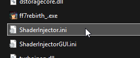

# ShaderInjector.ini Settings Guide

This is a guide for the ShaderInjector.ini settings file that gets autogenerated on first boot when you first install the mod.



### Contents

```INI
[InjectorSettings]
InjectorEnabled=true
MenuOpen=true
OpenMenuKey=45
ToggleInjectorKey=36
```

- **InjectorEnabled:** *(true/false)* This sets whether the injector is enabled on startup, or disabled on startup.
- **MenuOpen:** *(true/false)* This sets whether the injector menu is visible on startup, or hidden on startup
- **OpenMenuKey:** *(integer)* This is the keycode for opening or closisng the injector menu on the keypress. Default is [Insert / 45].
- **ToggleInjectorKey:** *(integer)* This is the keycode for enabling or disabling the injector on a keypress. Default is [Home / 36]

*NOTE: if ini file has invalid values for these fields, the file will fail to parse and injector will use default settings.*

### Virtual Key Codes

To make your life easier, here is a table of keybind values. [This is from Microsoft Virtual Keycodes](https://learn.microsoft.com/en-us/windows/win32/inputdev/virtual-key-codes). The values provided in the offical document are in hexadecimal, [so they need to be converted to a decimal value if you are to write it in to the ini file](https://www.rapidtables.com/convert/number/hex-to-decimal.html). To save you work I've provided you a table already with all of the keycodes converted into decimal values, you're welcome!

| Key Name | Decimal Value | Notes |
| -------- | ------------- | ----- |
| LeftMouse | 1 | 0x01 Left mouse button |
| RightMouse | 2 | 0x02 Right mouse button |
| ControlBreak | 3 | 0x03 Control - break processing |
| MiddleMouse | 4 | 0x04 Middle mouse button(three - button mouse) |
| X1MouseButton | 5 | 0x05 X1 mouse button |
| X2MouseButton | 6 | 0x06 X2 mouse button |
| 0 | 48 | 0x30 0 key (Top number row) |
| 1 | 49 | 0x31 1 key (Top number row) |
| 2 | 50 | 0x32 2 key (Top number row) |
| 3 | 51 | 0x33 3 key (Top number row) |
| 4 | 52 | 0x34 4 key (Top number row) |
| 5 | 53 | 0x35 5 key (Top number row) |
| 6 | 54 | 0x36 6 key (Top number row) |
| 7 | 55 | 0x37 7 key (Top number row) |
| 8 | 56 | 0x38 8 key (Top number row) |
| 9 | 57 | 0x39 9 key (Top number row) |
| Numpad0 | 96 | 0x60 Numeric keypad 0 key |
| Numpad1 | 97 | 0x61 Numeric keypad 1 key |
| Numpad2 | 98 | 0x62 Numeric keypad 2 key |
| Numpad3 | 99 | 0x63 Numeric keypad 3 key |
| Numpad4 | 100 | 0x64 Numeric keypad 4 key |
| Numpad5 | 101 | 0x65 Numeric keypad 5 key |
| Numpad6 | 102 | 0x66 Numeric keypad 6 key |
| Numpad7 | 103 | 0x67 Numeric keypad 7 key |
| Numpad8 | 104 | 0x68 Numeric keypad 8 key |
| Numpad9 | 105 | 0x69 Numeric keypad 9 key |
| A | 65 | 0x41 A key |
| B | 66 | 0x42 B key |
| C | 67 | 0x43 C key |
| D | 68 | 0x44 D key |
| E | 69 | 0x45 E key |
| F | 70 | 0x46 F key |
| G | 71 | 0x47 G key |
| H | 72 | 0x48 H key |
| I | 73 | 0x49 I key |
| J | 74 | 0x4A J key |
| K | 75 | 0x4B K key |
| L | 76 | 0x4C L key |
| M | 77 | 0x4D M key |
| N | 78 | 0x4E N key |
| O | 79 | 0x4F O key |
| P | 80 | 0x50 P key |
| Q | 81 | 0x51 Q key |
| R | 82 | 0x52 R key |
| S | 83 | 0x53 S key |
| T | 84 | 0x54 T key |
| U | 85 | 0x55 U key |
| V | 86 | 0x56 V key |
| W | 87 | 0x57 W key |
| X | 88 | 0x58 X key |
| Y | 89 | 0x59 Y key |
| Z | 90 | 0x5A Z key |
| F1 | 112 | 0x70 F1 key |
| F2 | 113 | 0x71 F2 key |
| F3 | 114 | 0x72 F3 key |
| F4 | 115 | 0x73 F4 key |
| F5 | 116 | 0x74 F5 key |
| F6 | 117 | 0x75 F6 key |
| F7 | 118 | 0x76 F7 key |
| F8 | 119 | 0x77 F8 key |
| F9 | 120 | 0x78 F9 key |
| F10 | 121 | 0x79 F10 key |
| F11 | 122 | 0x7A F11 key |
| F12 | 123 | 0x7B F12 key |
| F13 | 124 | 0x7C F13 key |
| F14 | 125 | 0x7D F14 key |
| F15 | 126 | 0x7E F15 key |
| F16 | 127 | 0x7F F16 key |
| F17 | 128 | 0x80 F17 key |
| F18 | 129 | 0x81 F18 key |
| F19 | 130 | 0x82 F19 key |
| F20 | 131 | 0x83 F20 key |
| F21 | 132 | 0x84 F21 key |
| F22 | 133 | 0x85 F22 key |
| F23 | 134 | 0x86 F23 key |
| F24 | 135 | 0x87 F24 key |
| Multiply | 106 | 0x6A Multiply key |
| Add | 107 | 0x6B Add key |
| Separator | 108 | 0x6C Separator key |
| Subtract | 109 | 0x6D Subtract key |
| Decimal | 110 | 0x6E Decimal key |
| Divide | 111 | 0x6F Divide key |
| Backspace | 8 | 0x08 BACKSPACE key |
| Tab | 9 | 0x09 TAB key |
| Clear | 12 | 0x0C CLEAR key |
| Enter | 13 | 0x0D ENTER key |
| Shift | 16 | 0x10 SHIFT key |
| Ctrl | 17 | 0x11 CTRL key |
| Alt | 18 | 0x12 ALT key |
| Pause | 19 | 0x13 PAUSE key |
| CapsLock | 20 | 0x14 CAPS LOCK key |
| Escape | 27 | 0x1B ESC key |
| Space | 32 | 0x20 SPACEBAR |
| PageUp | 33 | 0x21 PAGE UP key |
| PageDown | 34 | 0x22 PAGE DOWN key |
| End | 35 | 0x23 END key |
| Home | 36 | 0x24 HOME key |
| LeftArrow | 37 | 0x25 LEFT ARROW key |
| UpArrow | 38 | 0x26 UP ARROW key |
| RightArrow | 39 | 0x27 RIGHT ARROW key |
| DownArrow | 40 | 0x28 DOWN ARROW key |
| Select | 41 | 0x29 SELECT key |
| Print | 42 | 0x2A PRINT key |
| Execute | 43 | 0x2B EXECUTE key |
| PrintScreen | 44 | 0x2C PRINT SCREEN key |
| Insert | 45 | 0x2D INS key |
| Delete | 46 | 0x2E DEL key |
| Help | 47 | 0x2F HELP key |
| LeftWindows | 91 | 0x5B Left Windows key(Natural keyboard) |
| RightWindows | 92 | 0x5C Right Windows key(Natural keyboard) |
| Applications | 93 | 0x5D Applications key(Natural keyboard) |
| Sleep | 95 | 0x5F Computer Sleep key |
| NumLock | 144 | 0x90 NUM LOCK key |
| ScrollLock | 145 | 0x91 SCROLL LOCK key |
| LeftShift | 160 | 0xA0 Left SHIFT key |
| RightShift | 161 | 0xA1 Right SHIFT key |
| LeftControl | 162 | 0xA2 Left CONTROL key |
| RightControl | 163 | 0xA3 Right CONTROL key |
| LeftAlt | 164 | 0xA4 Left ALT key |
| RightAlt | 165 | 0xA5 Right ALT key |
| BrowserBack | 166 | 0xA6 Browser Back key |
| BrowserForward | 167 | 0xA7 Browser Forward key |
| BrowserRefresh | 168 | 0xA8 Browser Refresh key |
| BrowserStop | 169 | 0xA9 Browser Stop key |
| BrowserSearch | 170 | 0xAA	Browser Search key |
| BrowserFavorites | 171 | 0xAB Browser Favorites key |
| BrowserStartAndHome | 172 | 0xAC Browser Start and Home key |
| VolumeMute | 173 | 0xAD Volume Mute key |
| VolumeDown | 174 | 0xAE Volume Down key |
| VolumeUp | 175 | 0xAF Volume Up key |
| NextTrack | 176 | 0xB0 Next Track key |
| PreviousTrack | 177 | 0xB1 Previous Track key |
| StopMedia | 178 | 0xB2 Stop Media key |
| PlayPauseMedia | 179 | 0xB3 Play / Pause Media key |
| StartMail | 180 | 0xB4 Start Mail key |
| SelectMedia | 181 | 0xB5 Select Media key |
| StartApplication1 | 182 | 0xB6 Start Application 1 key |
| StartApplication2 | 183 | 0xB7 Start Application 2 key |
| MiscCharacters | 186 | 0xBA Used for miscellaneous characters it can vary by keyboard. For the US standard keyboard, the ':' key |
| Packet | 231 | 0xE7 Used to pass Unicode characters as if they were keystrokes. The VK_PACKET key is the low word of a 32 - bit Virtual Key value used for non - keyboard input methods. For more information, see Remark in KEYBDINPUT, SendInput, WM_KEYDOWN, and WM_KEYUP |
| Attn | 246 | 0xF6 Attn key |
| CrSel | 247 | 0xF7 CrSel key |
| ExSel | 248 | 0xF8 ExSel key |
| EraseEOF | 249 | 0xF9 Erase EOF key |
| Play | 250 | 0xFA Play key |
| Zoom | 251 | 0xFB Zoom key |
| PA1 | 253 | 0xFD PA1 key |
| Clear | 254 | 0xFE Clear key |
| OEM_Plus | 187 | 0xBB For any country / region, the '+' key |
| OEM_Comma | 188 | 0xBC For any country / region, the ',' key |
| OEM_Minus | 189 | 0xBD For any country / region, the '-' key |
| OEM_Period | 190 | 0xBE For any country / region, the '.' key |
| OEM_2 | 191 | 0xBF Used for miscellaneous characters it can vary by keyboard. For the US standard keyboard, the '/?' key |
| OEM_3 | 192 | 0xC0 Used for miscellaneous characters it can vary by keyboard. For the US standard keyboard, the '`~' key |
| OEM_4 | 219 | 0xDB Used for miscellaneous characters it can vary by keyboard. For the US standard keyboard, the '[{' key |
| OEM_5 | 220 | 0xDC Used for miscellaneous characters it can vary by keyboard. For the US standard keyboard, the '\|' key |
| OEM_6 | 221 | 0xDD Used for miscellaneous characters it can vary by keyboard. For the US standard keyboard, the ']}' key |
| OEM_7 | 222 | 0xDE Used for miscellaneous characters it can vary by keyboard. For the US standard keyboard, the 'single-quote/double-quote' key |
| OEM_8 | 223 | 0xDF Used for miscellaneous characters it can vary by keyboard. |
| OEM_102 | 226 | 0xE2 The <> keys on the US standard keyboard, or the \\ | key on the non - US 102 - key keyboard |
| IME_KanaHanguel | 21 | 0x15 (IME Kana mode) (IME Hanguel mode(maintained for compatibility use VK_HANGUL)) (IME Hangul mode) |
| IME_On | 22 | 0x16 IME On |
| IME_Junja | 23 | 0x17 IME Junja mode |
| IME_Final | 24 | 0x18 IME final mode |
| IME_HanjaKanji | 25 | 0x19 (IME Hanja mode) (IME Kanji mode) |
| IME_Off | 26 | 0x1A IME Off |
| IME_Convert | 28 | 0x1C IME convert |
| IME_NonConvert | 29 | 0x1D IME nonconvert |
| IME_Accept | 30 | 0x1E IME accept |
| IME_ModeChangeRequest | 31 | 0x1F IME mode change request |
| IME_Process | 229 | 0xE5 IME PROCESS key |