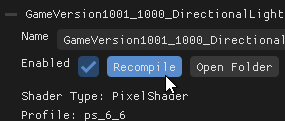

# Live Shader Editing

A note-worthy feature of the Shader Injector is that shaders can be edited and reloaded live during runtime. Whether you are tweaking an existing shader, or creating one from scratch, this should make your workflow far quicker and easier.

### Shader Sources

The raw .hlsl shader source code files are located in ```(game directory)/ShaderInjector/ModifiedShaders```. 

<p float="left">
    
    
    
    
</p>

Now there is a lot of modified shaders, but the real meat is inside the ```Includes``` folder, this stores the real meat of the shaders. It's a centralized spot that all of the other shaders outside of includes effectively point to.

### Editing
You can open the raw .hlsl source code shaders in a text editor *(or code editor)* of your choice and edit them to your liking. The modified pixel shaders provided by the mod are written with pre-processor macros that are wired up, where you can easily toggle or adjust certain shader features.


*LocalLightShader.hlsl written with macros at the very top of the file*

If you are a experienced with HLSL you can skip this explanation, but for those who arent heres a very quick and brief rundown to configure things within a shader source code...

Enabling/Disabling a shader feature

```HLSL
//feature is enabled
#define FEATURE   

//feature is disabled
//#define FEATURE
```

Changing a value
```HLSL
//a define variable set with a value
#define FEATURE_VALUE 1.0

//the value can be changed
#define FEATURE_VALUE 100.0
```

Make sure to save changes before you [recompile](#reloading-changes) in Shader Injector.

### Recompile / Reload Changes

Once you've made a change, tab or go back into the game and under ```Modified Shaders``` menu. Then select the modified shader that is pointing to the shader that you are editing, in my case ```LocalLightShader.hlsl```, and click simply ```Recompile```. Your changes should be reflected immedieatly.



*NOTE:* if you are a bit lazier you could also click up above the ```Recompile All``` which will recompile all of the modified shaders.


If your changes are not being reflected or updated, there is a good chance you might be hitting a compilation error *(or something similar)*. Check under the ```Logs``` section within the shader injector menu, and correct the compilation errors. 


*NOTE: Currently the shader injector does not provide the exact compilation errors in the logs, this should be improved on future updates.*

### Examples

Some examples to illustrate

<p float="left">
    
    
    
</p>

*Example: Tinting the light color within the ```LocalLightShader.hlsl```* *(NOTE: These are older screenshots with an older UI)*
