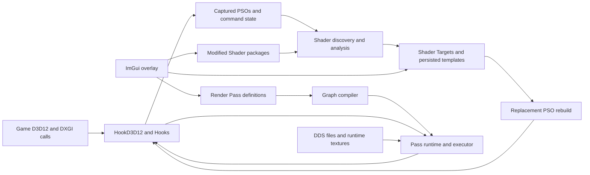

# Shader Injector architecture baseline and redesign map

**Snapshot:** 2026-09-21, `dev-3.0` at `b9016a4`, including the current uncommitted working-tree refactor. The source reports version `3.0.0.0` in [ShaderInjectorVersion.h](../ShaderInjectorVersion.h#L4). This is a reading of the implementation, not a statement that every path has been exercised in a game. The working tree already contained many modified and deleted source files when this document was written; this document does not incorporate an imagined clean-branch state.

## 1. System in one page

Shader Injector is a Windows `dsound.dll` proxy loaded into a D3D12 game's process. It forwards DirectSound exports to the system DLL, installs D3D12/DXGI interception with MinHook, observes pipeline creation and command recording, and substitutes rebuilt pipeline state objects (PSOs) at bind time. It also supports user-authored shader packages, automatic shader identification, injected render passes with managed textures, and an ImGui overlay. The project is aimed at Final Fantasy VII Rebirth, while much of the interception logic is D3D12-oriented rather than game-specific. [Proxy](../dsound_proxy.cpp#L1), [startup](../dllmain.cpp#L27), [hook installation](../Hooks.cpp#L47), [project configuration](../ShaderInjector.vcxproj#L75).

The important distinction is **three related authoring objects**. A *Modified Shader* package supplies source and compiled bytecode. A *Shader Target* identifies an original game shader and stores enough pipeline evidence to apply that bytecode to matching PSOs, including across warmed-cache launches. A *Render Pass* defines extra GPU work triggered by an original shader or another pass, with its own shader sources, inputs, outputs, and timing. They are stored independently and joined by IDs. [ModifiedShaderPackageDisk](../ModifiedShader/ModifiedShaderPackageDisk.h#L13), [ShaderTargetDisk](../ShaderTarget/ShaderTargetDisk.h#L15), [RenderPassDisk](../RenderPass/RenderPass.h#L153).

## 2. Repository and build shape

| Area | Responsibility | Representative entry points |
| --- | --- | --- |
| Root files | DLL entry, proxy, globals, shader analysis/discovery, input, helpers | [dllmain.cpp](../dllmain.cpp), [ShaderAutomaticDiscovery.cpp](../ShaderAutomaticDiscovery.cpp), [ShaderDiscovery.cpp](../ShaderDiscovery.cpp) |
| `HookD3D12/` | Device/queue/list/swap-chain hooks, captured PSOs, replacement rebuilds, overlay | [HookD3D12.h](../HookD3D12/HookD3D12.h), [HookD3D12.cpp](../HookD3D12/HookD3D12.cpp), [HookD3D12Install.cpp](../HookD3D12/HookD3D12Install.cpp) |
| `ModifiedShader/` | Package JSON, source/blob association, compilation, package actions | [DatabaseModifiedShaders.cpp](../ModifiedShader/DatabaseModifiedShaders.cpp), [DatabaseModifiedShadersCompilation.cpp](../ModifiedShader/DatabaseModifiedShadersCompilation.cpp) |
| `ShaderTarget/` and `Database/` | Target serialization, template sidecars, captured graphics/compute/stream PSOs | [ShaderTargetDisk.h](../ShaderTarget/ShaderTargetDisk.h), [DatabaseShaderTargets.cpp](../ShaderTarget/DatabaseShaderTargets.cpp), [DatabaseStreamPSOs.cpp](../Database/DatabaseStreamPSOs.cpp) |
| `RenderPass/` | Pass schema, database, graph, runtime, executor, texture pool and registry | [RenderPass.h](../RenderPass/RenderPass.h), [RenderPassGraph.cpp](../RenderPass/RenderPassGraph.cpp), [RenderPassRuntime.cpp](../RenderPass/RenderPassRuntime.cpp) |
| `ShaderResource/` and `DDS/` | DDS catalog and validation, disk texture upload, runtime binding | [DatabaseShaderResources.cpp](../ShaderResource/DatabaseShaderResources.cpp), [ShaderResourceRuntime.cpp](../ShaderResource/ShaderResourceRuntime.cpp), [DDS.cpp](../DDS/DDS.cpp) |
| `ShaderConfiguration/` | Parse HLSL defines into editable properties; rewrite HLSL and save JSON | [DatabaseShaderConfigurations.cpp](../ShaderConfiguration/DatabaseShaderConfigurations.cpp), [DatabaseShaderConfigurationsApply.cpp](../ShaderConfiguration/DatabaseShaderConfigurationsApply.cpp) |
| `GUI/` | In-game editor, lists, logs, settings and diagnostics | [ShaderInjectorGUI.cpp](../GUI/ShaderInjectorGUI.cpp), [ShaderInjectorGUI_RenderPasses.cpp](../GUI/ShaderInjectorGUI_RenderPasses.cpp) |
| `IO/`, `RenderDoc/`, `Performance/` | Paths, process/compiler execution, logs/settings, capture integration, timing | [ShaderInjectorIO.h](../IO/ShaderInjectorIO.h), [RenderDocIntegration.cpp](../RenderDoc/RenderDocIntegration.cpp), [PerformanceMetrics.cpp](../Performance/PerformanceMetrics.cpp) |
| `Tests/`, `Validation/` | CPU graph tests and WARP-based recovery tests | [Tests/README.md](../Tests/README.md), [Validation/README.md](../Validation/README.md) |

The Visual Studio C++17 project builds a dynamic library named `dsound` and links D3D12, DXGI and MinHook. Vendored dependencies include MinHook, ImGui, nlohmann JSON, inifile-cpp and the RenderDoc API header. The solution file contains the DLL project; the two test projects are separate `.vcxproj` files. [Project settings](../ShaderInjector.vcxproj#L75), [project dependencies](../ShaderInjector.vcxproj#L148), [solution](../../ShaderInjector.sln).

The code volume is concentrated in a few units: `RenderPassRuntime.cpp` is about 3,000 physical lines, `HookD3D12.cpp` about 2,700, the render-pass UI about 2,400, and the resource registry about 1,900. The many small `HookD3D12/D3D12/HookD3D12_*.cpp` files isolate individual intercepted calls, but they share declarations and state through the central hook headers. This is a navigation and ownership issue, not evidence by itself that the code should be split further.

## 3. Startup, frame and shutdown lifecycle

1. `DllMain` stores the module handle and starts a worker thread. That thread loads the real `dsound.dll`, rotates logs, reads settings, initializes optional RenderDoc integration and MinHook, and installs an **early** DXGI factory hook to capture swap-chain creation. A fixed five-second delay precedes IO setup. It then loads Modified Shaders, Shader Targets, Render Passes and internal marker/null shaders, checks for `d3d12.dll`, installs the D3D12 create-device hook, builds dummy D3D12/DXGI objects for vtable addresses, installs the remaining hooks, and marks the runtime ready. [dllmain.cpp](../dllmain.cpp#L27), [Hooks.cpp](../Hooks.cpp#L61).
2. Device and pipeline creation hooks capture shader bytecode, descriptors, cached blobs and root signatures. Discovery queues candidate shaders; target matching/rebuild work is deferred. `Present` advances the render-pass frame, drains pending PSO rebuilds and, after the overlay is ready, draws the ImGui UI. [HookD3D12.h](../HookD3D12/HookD3D12.h#L96), [Present hook](../HookD3D12/D3D12/HookD3D12_PresentD3D12.cpp#L28), [apply work](../HookD3D12/HookD3D12.cpp#L1893).
3. Command-list hooks record state needed for pass insertion and restoration: pipeline, root signatures and arguments, descriptor heaps/tables, input assembly, render targets, viewport/scissor and draw/dispatch boundaries. Queue submission and list reset drive resource-retirement and state-reset notifications. [RenderPassRuntime.h](../RenderPass/RenderPassRuntime.h#L51), [ShaderResourceRuntime.h](../ShaderResource/ShaderResourceRuntime.h#L21).
4. The overlay obtains the presenting queue from a captured swap-chain association, or adopts the most recent direct queue as a fallback for swap chains created before interception. It creates ImGui/D3D12 device objects and uses per-back-buffer allocator/fence state. [Hooks.cpp](../Hooks.cpp#L47), [Present hook](../HookD3D12/D3D12/HookD3D12_PresentD3D12.cpp#L72), [FrameContext.h](../HookD3D12/FrameContext.h).

**Lifecycle seam:** startup readiness is represented by several stages and flags (`gRuntimeReady`, overlay initialization, captured device/queue, loaded target flags). `HookD3D12::Release()` has a substantial cleanup path, but no call to it was found in this checkout; `DllMain`'s detach branch directly disables MinHook and frees `dsound`. The full release path is therefore not the observed detach contract. Define the intended process-lifetime or unload behavior before changing hook ownership. This is an audit item, not a claim of a demonstrated leak. [release](../HookD3D12/HookD3D12.cpp#L2631), [detach](../dllmain.cpp#L183).

## 4. Feature map

| User-visible capability | Current mechanism | Main code |
| --- | --- | --- |
| Replace game shaders | Identify original shader from captured PSO; rebuild a PSO with compiled Modified Shader bytes; substitute at `SetPipelineState` | [HookD3D12.cpp](../HookD3D12/HookD3D12.cpp#L1515), [SetPipelineState hook](../HookD3D12/D3D12/HookD3D12_SetPipelineState.cpp) |
| Discover targets automatically | Capture unique candidates; direct hash lookup or optional analysis-based cross-version matching; persist generated targets | [ShaderAutomaticDiscovery.cpp](../ShaderAutomaticDiscovery.cpp#L669), [ShaderDiscovery.cpp](../ShaderDiscovery.cpp#L146) |
| Survive warmed PSO caches | Match cached blob/template metadata for uncaptured PSOs and rebuild from persisted graphics/stream templates where possible | [replacement lookup](../HookD3D12/HookD3D12ReplacementLookup.cpp), [uncaptured apply](../HookD3D12/HookD3D12.cpp#L1578) |
| Edit/recompile shaders in game | Modified Shader package actions compile source to a blob and reload linked targets; SM6 uses bundled `dxc`, SM5 uses a Windows D3DCompiler DLL | [GUI action](../GUI/ShaderInjectorGUI_ModifiedShaders.cpp#L50), [compiler](../IO/ShaderInjectorIO_Shader.cpp#L305) |
| Edit HLSL macros in overlay | Parse annotated/plain `#define` lines, store editable properties, rewrite sources, then recompile active packages | [parser](../ShaderConfiguration/ShaderConfigurationParsing.cpp#L92), [apply](../ShaderConfiguration/DatabaseShaderConfigurationsApply.cpp#L15), [UI](../GUI/ShaderInjectorGUI_ShaderConfiguration.cpp#L209) |
| Add render work | Graph-ordered custom, replacement, mip-chain, copy, resolve and temporal-history operations at a shader or pass event | [schema](../RenderPass/RenderPass.h#L153), [graph](../RenderPass/RenderPassGraph.h#L16), [runtime](../RenderPass/RenderPassRuntime.h#L21) |
| Bind resources | Load DDS files; create transient/persistent runtime textures; bind inherited game resources, SRVs, UAVs and samplers to injected passes | [resource database](../ShaderResource/DatabaseShaderResources.cpp#L17), [binding runtime](../ShaderResource/ShaderResourceRuntime.cpp#L681), [texture pool](../RenderPass/RenderPassTexturePool.cpp) |
| Inspect and diagnose | Shader/PSO lists, runtime logs, pipeline state, pass diagnostics, optional RenderDoc capture, optional performance telemetry | [GUI](../GUI/ShaderInjectorGUI.cpp#L75), [RenderDoc](../RenderDoc/RenderDocIntegration.h#L10), [metrics](../Performance/PerformanceMetrics.h#L9) |

The repository's top-level README still labels custom render passes as a TODO, whereas this checkout has a render-pass schema, editor, graph, runtime and tests. Treat the current source and tests as the implementation baseline; update public documentation as part of any eventual feature stabilization. [README](../../README.md), [RenderPass.h](../RenderPass/RenderPass.h), [Tests/README.md](../Tests/README.md).

There is a smaller user-facing drift too: the code initializes the injector toggle key to `VK_DELETE`, while the settings guide calls Home the default. The saved INI can override it, but the documented first-run behavior should match the implementation. [Globals.cpp](../Globals.cpp#L26), [settings guide](../../InjectorSettings.md#L22).

## 5. Persistent data and identity

| Artifact | Location relative to game executable | Stable identity / content | Runtime owner |
| --- | --- | --- | --- |
| `ShaderInjector.ini` | executable directory | UI, compiler, logging, RenderDoc and discovery settings | `Globals` and `ShaderInjectorIO` |
| Modified Shader package | `ShaderInjector/ModifiedShaders/<package>/` | JSON package ID, HLSL source, compiled `.blob`, target fingerprints | `DatabaseModifiedShaders` |
| Shader Target | `ShaderInjector/ShaderTargets/.../ShaderTarget.json` plus sidecars | original shader hash/aliases and analysis, package ID, pipeline templates and cached-blob metadata | `HookD3D12` target arrays |
| Render Pass | `ShaderInjector/RenderPasses/<package>/` | JSON pass ID, event, operation, bindings, source/blob paths | `DatabaseRenderPasses` and `RenderPassRuntime` |
| Shader Configuration | `ShaderInjector/ModifiedShaders/ShaderConfigurations.json` | properties keyed by source path, define name and occurrence index | `DatabaseShaderConfigurations` |
| Shader Resource | `ShaderInjector/ShaderResources/**/*.dds` | relative path ID and DDS metadata | `DatabaseShaderResources`, catalog and runtime |
| Diagnostics/internal files | `ShaderInjector/Logs`, `Dumps`, `Internal`, `UncapturedPSOs`, `Tools` | logs, shader dumps, generated internal blobs and tools | `ShaderInjectorIO` and feature owners |

These paths are assembled centrally in [ShaderInjectorIO_Directories.cpp](../IO/ShaderInjectorIO_Directories.cpp#L11). The schemas mix portable serialized fields with resolved runtime paths and loaded blobs in some structures; for example `ShaderTargetDisk` includes `modifiedShaderBlobPath` and `ModifiedShaderPackageDisk` includes in-memory bytes and analysis. Serialization strips or normalizes some of this data. [ShaderTargetDisk.h](../ShaderTarget/ShaderTargetDisk.h#L15), [ModifiedShaderPackageDisk.h](../ModifiedShader/ModifiedShaderPackageDisk.h#L13), [ShaderTargetIO.cpp](../ShaderTarget/ShaderTargetIO.cpp#L20).

An original shader hash is the fastest exact identifier. Target and package analyses add reflection and normalized-instruction fingerprints for cross-version candidates, with score and ambiguity thresholds. PSO template identity is a separate concern: it describes the pipeline context required to safely rebuild a matching object. Keeping these identities separate is important in any new model. [ShaderAnalysis.h](../ShaderAnalysis.h#L241), [ShaderDiscovery.cpp](../ShaderDiscovery.cpp#L146), [ShaderPipelineTemplateDisk.h](../ShaderTarget/ShaderPipelineTemplateDisk.h#L11).

## 6. Shader capture, discovery and replacement in detail

### Capture and candidate selection

Graphics, compute and stream PSO creation handlers call the original API first, then copy the parts needed after the caller's descriptor has gone away. Graphics capture owns stage bytecode, input-layout and stream-output strings, the root signature and a copy of the descriptor; stream capture owns the stream blob and pointer-bearing metadata. Pipeline-library loads are intercepted too. This ownership is necessary because the game may release its original descriptor memory immediately. [graphics capture](../Database/DatabaseGraphicsPSOs.cpp#L14), [compute capture](../Database/DatabaseComputePSOs.cpp#L14), [stream capture](../Database/DatabaseStreamPSOs.cpp#L13), [pipeline-library hooks](../HookD3D12/HookD3D12PipelineLibrary.cpp#L17).

Automatic discovery deduplicates by `(shader hash, shader stage)`, queues candidates with a bounded size and priority, and submits analysis jobs from frame-driven processing. Direct hash matches can complete on the render path; analysis-mode jobs use worker threads, while the eventual target creation/compilation step returns to the frame-driven completion path. Enqueuing supports VS/HS/DS/GS/PS/CS. Stream metadata has AS/MS fields, but `ShaderTarget::ShaderType` and the automatic queue do not currently expose mesh/amplification replacement as a target type. [queue state](../ShaderAutomaticDiscovery.cpp#L76), [enqueue](../ShaderAutomaticDiscovery.cpp#L669), [worker](../ShaderAutomaticDiscovery.cpp#L958), [frame drain](../ShaderAutomaticDiscovery.cpp#L1211), [stage enum](../Enum/ShaderType.h#L6).

`ShaderAnalyzer` produces a rich `ShaderAnalysisDisk`: container parts, signatures, resource/constant-buffer layouts, instruction statistics, execution properties, portable reflection identity and a semantic instruction identity. An optional portable-reflection allow-list skips expensive disassembly for impossible matches. DXC analysis itself is guarded by a global analyzer mutex, so worker concurrency does not imply parallel DXC reflection/disassembly. [analysis schema](../ShaderAnalysis.h#L245), [analyzer](../ShaderAnalyzer.cpp#L358), [disassembly](../ShaderAnalyzer.cpp#L260).

Matching has several levels:

1. The package index first checks known original shader hashes; duplicate package claims are rejected as ambiguous. In analysis mode it compares an eligible shader against package target fingerprints, requiring configured minimum score and separation from the next candidate. [package matcher](../ShaderDiscovery.cpp#L361), [settings](../Globals.cpp#L36).
2. Existing Shader Targets first match their original hash or alias. Cross-version discovery requires compatible stage and a tight byte-length window, then checks portable reflection and exact cross-version identity. A fuzzy score is permitted only above the threshold and ambiguity margin. Successful aliases are persisted. [target matcher](../ShaderDiscovery.cpp#L146), [alias persistence](../ShaderDiscovery.cpp#L121).
3. For a game PSO seen only from a warmed cache, lookup tries cached-blob hash/metadata and guarded content similarity, refuses ambiguous candidates, then reconstructs a PSO from persisted graphics or stream templates. The stream path must restore a valid root signature and pointer-bearing subobject data; failure can be retried when new root-signature evidence appears. [cache lookup](../HookD3D12/HookD3D12ReplacementLookup.cpp#L703), [uncaptured rebuild](../HookD3D12/HookD3D12.cpp#L1578), [template sidecars](../HookD3D12/HookD3D12ReplacementTemplates.cpp).

When a match creates a new Shader Target, creation records the selected shader hash, captured PSO metadata, original bytecode and sidecars, links the Modified Shader ID and queues replacement work. Package compilation verifies the reflected interface against target data, tries prefix-stable then optimized signature packing, and preserves an older blob on incompatible compilation. A target is effectively enabled only when both target and package are enabled, the stages agree and the compiled interface matches. [target creation](../HookD3D12/HookD3D12ReplacementCreation.cpp#L39), [package compile](../ModifiedShader/DatabaseModifiedShadersCompilation.cpp#L198), [effective enablement](../ShaderTarget/DatabaseShaderTargets.cpp#L30).

The actual swap is delayed: the apply loop waits for pipeline creation to be idle, processes retry queues and captured/uncaptured PSOs within budgets, publishes an override map, and `SetPipelineState` resolves the requested PSO through that map. Injected API calls use a scoped guard to avoid observing themselves as game work. [apply loop](../HookD3D12/HookD3D12.cpp#L1893), [override publication](../HookD3D12/HookD3D12.cpp#L514), [SetPipelineState hook](../HookD3D12/D3D12/HookD3D12_SetPipelineState.cpp#L16), [guard](../HookD3D12/HookD3D12RenderPass.cpp#L5).

One end-to-end edit illustrates the ownership chain. A user changes a macro in the Shader Configuration UI. `ApplyChanges` rewrites HLSL files and the configuration JSON; the UI then requests recompilation of active Modified Shader packages. Each successful compile updates the package blob, reloads linked Shader Targets and invalidates existing replacement PSOs. The frame-driven apply path rebuilds those PSOs and publishes an updated override lookup. A Render Pass anchored to the same Modified Shader resolves its event through the separately published pass graph and target bindings. The user action therefore crosses configuration, package, target, PSO and pass boundaries even though the UI presents it as one action. [apply UI](../GUI/ShaderInjectorGUI_ShaderConfiguration.cpp#L209), [configuration write](../ShaderConfiguration/DatabaseShaderConfigurationsApply.cpp#L15), [recompile orchestration](../GUI/ShaderInjectorGUI_ModifiedShaders.cpp#L50), [target reload](../ShaderTarget/DatabaseShaderTargetsActions.cpp#L22), [pass bindings](../RenderPass/RenderPassRuntime.cpp#L1518).

**Important invariants for a redesign:**

- The active PSO must remain compatible with the game's root signature, shader input/output interface and fixed-function pipeline state. The current interface check and pipeline-template matching are distinct safeguards; merging them into a single hash would lose evidence. [interface check](../ModifiedShader/DatabaseModifiedShadersCompilation.cpp#L87), [template matching](../HookD3D12/HookD3D12ReplacementLookup.cpp).
- Ambiguity should remain a first-class result. The current matchers deliberately return no match for duplicate exact identities or close-scoring candidates. [ShaderDiscovery.cpp](../ShaderDiscovery.cpp#L146), [cached lookup](../HookD3D12/HookD3D12ReplacementLookup.cpp#L703).
- A rebuilt PSO may still be referenced by recorded GPU commands after a new replacement is published. The current code retires old objects for process lifetime; any new ownership model needs an explicit safe retirement point. [retirement](../HookD3D12/HookD3D12.cpp#L391).

### Discovery-specific design seams

- A queue key contains only shader hash and stage, so the first observed pipeline context normally wins target creation. Additional graphics/stream variants are handled later through templates/aliases, but the candidate model does not collect all initial contexts. This makes target generation order significant. [enqueue](../ShaderAutomaticDiscovery.cpp#L669), [matched completion](../ShaderAutomaticDiscovery.cpp#L876).
- Candidate length gates differ between queue filtering and target matching, while thresholds are read from `Globals`. This deserves one documented matching policy with named evidence and rejection reasons. [queue length ranges](../ShaderAutomaticDiscovery.cpp#L191), [target gate](../ShaderDiscovery.cpp#L53), [settings](../Globals.h#L64).
- A package is considered covered once it has a generated/loaded target; discovery can prune remaining work when all enabled packages are covered. If two packages claim the same original shader, existing-target conflict resolution is implicit. A redesigned index should expose this conflict in UI/diagnostics. [coverage check](../ShaderAutomaticDiscovery.cpp#L420), [pruning](../ShaderAutomaticDiscovery.cpp#L458), [match completion](../ShaderAutomaticDiscovery.cpp#L876).
- `ShaderTargetDisk` defaults to schema 6 and newly created targets use 6, but analysis/alias persistence currently writes 5. This is a concrete version-contract inconsistency to resolve before adding another schema. [schema default](../ShaderTarget/ShaderTargetDisk.h#L15), [creation](../HookD3D12/HookD3D12ReplacementCreation.cpp#L86), [analysis writes](../ShaderDiscovery.cpp#L113).

## 7. Render-pass and resource pipeline

The pass schema supports custom, mip-chain, temporal-history and replacement pass types. Operations include custom shader work, replacing an original draw/dispatch, copy, downsample/upsample, resolve and history rotation. An event refers to a Modified Shader or another Render Pass; `Before`/`After` timing and automatic/fullscreen/compute execution modes determine the insertion point. Inputs/outputs use logical resource IDs, origin, access, temporal view and shader register/space; runtime texture definitions provide format, resolution and lifetime policies. [RenderPass.h](../RenderPass/RenderPass.h#L18), [pass types](../Enum/RenderPassRenderPassType.h#L7), [operations](../Enum/RenderPassPassOperation.h#L7).

`DatabaseRenderPasses` loads and manages definitions, compiles pass shaders, and publishes a configuration snapshot. `RenderPassGraph::Compile` produces nodes with validation errors, dependencies and an execution plan per triggering Modified Shader, split by before/after boundaries. `RenderPassRuntime` tracks game command-list state and determines whether a draw/dispatch boundary needs work. The executor records fullscreen-triangle, compute or texture-copy work and restores the game's state. [database](../RenderPass/DatabaseRenderPasses.cpp), [graph](../RenderPass/RenderPassGraph.h#L16), [runtime API](../RenderPass/RenderPassRuntime.h#L21), [executor](../RenderPass/RenderPassExecutor.h#L13).

Texture inputs have three sources: disk DDS resources validated/cataloged by `DatabaseShaderResources`, runtime resources declared and owned by passes, and game resources found through intercepted descriptors/root bindings. The runtime uses a resource registry for game descriptor/resource metadata, a texture pool for pass outputs and reuse, and `ShaderResourceRuntime` for actual binding and descriptor allocation. Command-list reset, submission and frame advance are significant lifetime events. [DDS database](../ShaderResource/DatabaseShaderResources.cpp#L17), [catalog](../ShaderResource/ShaderResourceCatalog.cpp#L20), [registry](../RenderPass/RenderPassResourceRegistry.h), [texture pool](../RenderPass/RenderPassTexturePool.h), [binding API](../ShaderResource/ShaderResourceRuntime.h#L21).

Performance gates matter here. Render-pass configuration decides which extra hooks and state tracking are required; individual hooks check whether tracking is enabled and whether the current call is injector-owned. The system is designed to avoid paying full descriptor/state tracking cost when passes do not need it. Any replacement of the hook layer should preserve these gates and measure the cost of every new interception on draw/dispatch and descriptor paths. [installation](../HookD3D12/HookD3D12Install.cpp#L213), [tracking queries](../RenderPass/RenderPassRuntime.h#L29), [injection guard](../HookD3D12/HookD3D12RenderPass.cpp#L5).

### Graph and execution semantics

The graph compiler resolves each pass's event chain to a Modified Shader anchor, checks cycles and duplicate IDs, validates operation/backend compatibility and input/output contracts, and constructs dependency edges from event order and current-frame resource reads. Previous-frame history reads intentionally do not create current-frame edges. Invalidity propagates to dependent nodes. A stable topological order is produced separately for before and after boundaries, with replacement operations ordered after supporting work. The result includes mip-chain batches and graphics/compute boundary masks so hooks can avoid unnecessary work. [graph compile](../RenderPass/RenderPassGraph.cpp#L118), [resource dependencies](../RenderPass/RenderPassGraph.cpp#L320), [planning](../RenderPass/RenderPassGraph.cpp#L439).

Runtime publication copies pass definitions into an immutable configuration snapshot with graph and resolved bindings, atomically publishes it, and keeps older snapshots alive for command lists still using them. Shader Target-to-PSO binding snapshots are published separately. At an execution boundary, the runtime finds the active target, selects its plan, verifies required game resources, captures the state it needs, executes nodes in order and marks failed outputs unavailable to downstream nodes in that execution. It records per-pass counters and errors. [configuration publication](../RenderPass/RenderPassRuntime.cpp#L1252), [target bindings](../RenderPass/RenderPassRuntime.cpp#L1518), [boundary execution](../RenderPass/RenderPassRuntime.cpp#L1983).

The resource registry records descriptor heap ranges, SRV/UAV/CBV/RTV/DSV/sampler metadata, root-signature layouts and buffer address ranges. It propagates records through descriptor-copy APIs and resolves game resources from the bindings observed at the boundary. `ShaderResourceRuntime` clones active descriptor tables into injector-owned shader-visible pages, patches pass resources, binds them and restores the game heaps/tables afterward. Queue fences control descriptor-page reuse; uncertain fence state blocks reuse. [registry](../RenderPass/RenderPassResourceRegistry.cpp#L22), [copy propagation](../RenderPass/RenderPassResourceRegistry.cpp#L1319), [binding](../ShaderResource/ShaderResourceRuntime.cpp#L681), [restore](../ShaderResource/ShaderResourceRuntime.cpp#L1333), [retirement](../ShaderResource/ShaderResourceRuntime.cpp#L1382).

The texture pool resolves relative/explicit/downscaled dimensions and format against the triggering output, allocates SRV/UAV/RTV views, and reuses compatible textures. History resources use two versions; an unwritten previous version resolves to a typed null SRV. Configuration replacement retires old allocations because recorded command lists may still reference them. Mip-chain code has separate execution slots and fence retirement for generated or game-native mip work. [texture policy](../RenderPass/RenderPassTexturePool.cpp#L113), [history](../RenderPass/RenderPassTexturePool.cpp#L487), [typed null history](../RenderPass/RenderPassTexturePool.cpp#L703), [mip execution](../RenderPass/RenderPassMipChain.cpp#L1280).

The executor records the D3D12 operations: fullscreen triangle, compute dispatch or texture copy, including state transitions, barriers and restoration. This is where a graph-level operation becomes actual GPU commands. [fullscreen](../RenderPass/RenderPassExecutor.cpp#L298), [compute](../RenderPass/RenderPassExecutor.cpp#L455), [copy](../RenderPass/RenderPassExecutor.cpp#L548).

### Render-pass design seams

- `RenderPassDisk` is simultaneously a disk schema, an editable GUI object and a runtime cache of paths/compiled blobs. Loading and saving also normalize or repair semantic fields. A future model could separate *user intent*, *validated/compiled plan* and *live GPU resources*, preserving the JSON contract through an explicit adapter. [schema](../RenderPass/RenderPass.h#L153), [normalization](../RenderPass/RenderPass.cpp#L119), [load](../RenderPass/RenderPass.cpp#L236).
- The graph produces a pure `ExecutionPlan`, which runtime converts into its own event plan; the boundary handler then interprets operation types with resource and pipeline work. These are good candidates for a typed intermediate plan with prevalidated bindings and clear failure outputs. [graph plan](../RenderPass/RenderPassGraph.h#L25), [runtime plan publication](../RenderPass/RenderPassRuntime.cpp#L1252), [boundary execution](../RenderPass/RenderPassRuntime.cpp#L1983).
- Resource ownership spans the catalog, game-resource registry, texture pool, mip-chain slots, descriptor pages and executor caches. Their invalidation/retirement rules depend on different generations and fences. One resource-lifetime contract and diagram should precede any broad rewrite; immediate release would be unsafe for recorded GPU work. [catalog](../ShaderResource/ShaderResourceCatalog.cpp#L20), [pool](../RenderPass/RenderPassTexturePool.cpp#L23), [descriptor retirement](../ShaderResource/ShaderResourceRuntime.cpp#L1382).
- Generated resource IDs such as `<pass>:History` and mip/upsample IDs are string-derived. That works, but it hides producer ownership and namespace rules in conventions. A typed resource handle could make cross-pass and temporal dependencies clearer without changing the user-facing JSON IDs. [history ID](../RenderPass/RenderPass.cpp#L63), [upsample stages](../RenderPass/RenderPassTexturePool.cpp#L920).
- The render-pass editor is a large direct manipulator of `RenderPassDisk`, including semantic defaults and shader-artifact invalidation. Moving those actions behind a narrow application layer would let the GUI become a view of validated commands and make package edits testable without ImGui. [editor](../GUI/ShaderInjectorGUI_RenderPasses.cpp#L1218), [save](../RenderPass/DatabaseRenderPasses.cpp#L423).

## 8. Ownership, threading and hot-path constraints

This code runs inside a game process, on game render/PSO creation threads as well as its own attach and analysis threads. It therefore cannot treat a global reload like a normal desktop-app data refresh. Important ownership patterns in this checkout include:

| State | Current guard/lifetime | Consequence for redesign |
| --- | --- | --- |
| Captured graphics/compute/stream PSOs and pending replacement work | `HookD3D12` namespace vectors plus `gPipelineMutex`; override readers use published snapshots | Keep reads at `SetPipelineState` short and protect older PSOs until recorded commands finish. [state](../HookD3D12/HookD3D12.h#L61), [snapshot](../HookD3D12/HookD3D12.cpp#L514) |
| Modified Shader discovery | Queue mutexes, worker jobs with package snapshots, frame-driven result completion | Define what happens if packages/targets refresh while a job is in flight. [worker](../ShaderAutomaticDiscovery.cpp#L958), [refresh](../ShaderAutomaticDiscovery.cpp#L1151) |
| Render-pass configuration | Atomically published immutable snapshots with old snapshots retained | Make snapshot generation and eventual retirement explicit. [publication](../RenderPass/RenderPassRuntime.cpp#L1252) |
| Game descriptor/resource metadata | Domain-specific shared mutexes and descriptor pages | Avoid whole-registry locks on frequent descriptor writes and copies. [registry](../RenderPass/RenderPassResourceRegistry.cpp#L22) |
| Runtime textures, mip resources and cloned descriptors | Texture/pool slots and queue-fence retirement | GPU lifetime is longer than the C++ call that recorded the work. [texture pool](../RenderPass/RenderPassTexturePool.cpp#L541), [descriptor pages](../ShaderResource/ShaderResourceRuntime.cpp#L1382) |
| Overlay swap chain/queue | Captured association, fallback direct queue, per-back-buffer frame context/fence | Keep overlay readiness and resize separate from shader replacement readiness. [queue capture](../Hooks.cpp#L47), [Present](../HookD3D12/D3D12/HookD3D12_PresentD3D12.cpp#L72) |

The hook header and `HookD3D12RuntimeState.h` expose much of the process-wide singleton to individual hook files. This makes a hook wrapper able to reach queue capture, pipeline replacement, render-pass state and overlay resources directly. A useful boundary would have hook wrappers emit narrow observations to owners of those concerns, with explicit initialization and teardown order. That should be measured on hot hooks: abstraction must not add avoidable per-draw heap allocation, IO or locking. [public hook surface](../HookD3D12/HookD3D12.h#L25), [runtime state surface](../HookD3D12/D3D12/HookD3D12RuntimeState.h#L11).

## 9. Architecture findings and proposed order of work

The following are **design candidates**, not a decision to implement a new architecture wholesale. They are ordered to reduce risk before moving code.

| Priority | Finding and evidence | Concrete next design step |
| --- | --- | --- |
| 1 | Bootstrap has an early factory hook, a fixed delay, deferred device/list hooks, runtime-ready and overlay-ready gates. Hook installation logs individual failures without an aggregate success result. [startup](../dllmain.cpp#L53), [installation](../HookD3D12/HookD3D12Install.cpp#L80), [overlay gate](../HookD3D12/D3D12/HookD3D12_PresentD3D12.cpp#L575) | Write a lifecycle state machine and per-hook capability table. Define partial-install behavior and a single shutdown order before changing hook structure. |
| 1 | Persistence contracts are spread across package/target/pass structs, custom serialization and path normalization. Target alias/analysis writes can set schema 5 after creation at schema 6. [target serialization](../ShaderTarget/ShaderTargetSerialization.cpp#L12), [target paths](../ShaderTarget/ShaderTargetPaths.cpp#L24), [schema write](../ShaderDiscovery.cpp#L113) | Inventory fields and fixtures for each supported schema; define migrations and one writer per artifact. Fix the target version inconsistency separately. |
| 1 | Effective target enablement and discovery coverage are separate predicates. A disabled or interface-incompatible loaded target can satisfy the current package coverage count and stop further discovery. [effective enablement](../ShaderTarget/DatabaseShaderTargets.cpp#L30), [coverage](../ShaderAutomaticDiscovery.cpp#L407) | Define one explicit coverage/conflict result and test disabled, mismatched and duplicate claims. |
| 2 | `HookD3D12.cpp` owns queue/overlay state, replacement rebuild, override publication, uncaptured recovery and cleanup. UI and discovery also read mutable hook globals. [hook state](../HookD3D12/HookD3D12.cpp#L120), [UI coupling](../GUI/ShaderInjectorGUI_ShaderTargets.cpp#L148), [discovery coupling](../ShaderAutomaticDiscovery.cpp#L876) | Identify owners such as capture registry, replacement service, queue/overlay service and target repository; first extract interfaces and state ownership, then relocate code. |
| 2 | Render-pass runtime interprets graph plans while managing state snapshots, resource resolution, GPU execution and diagnostics. Old configuration snapshots remain retained. [runtime publication](../RenderPass/RenderPassRuntime.cpp#L1252), [execution](../RenderPass/RenderPassRuntime.cpp#L1983) | Stabilize graph output as an explicit validated execution plan, then isolate command-list state capture and resource lifetime from operation execution. |
| 2 | GUI handlers compile/reload packages, mutate database records and write files. Multi-file configuration apply stages writes but commits them one by one without rollback after a later failure. [GUI recompile](../GUI/ShaderInjectorGUI_ModifiedShaders.cpp#L50), [config apply](../ShaderConfiguration/DatabaseShaderConfigurationsApply.cpp#L15) | Put user actions behind command functions returning structured results; define atomicity/recovery for file operations before changing the editor. |
| 3 | Matching combines exact hashes, aliases, reflection/semantic scores and cached PSO heuristics across several modules; most rejection evidence is logged as strings. [discovery](../ShaderDiscovery.cpp#L146), [cache lookup](../HookD3D12/HookD3D12ReplacementLookup.cpp#L703) | Introduce typed match evidence and policy settings. Preserve ambiguity refusal; use recorded candidate fixtures to compare the old and new matchers. |
| 3 | Product and development documentation do not yet describe the implemented render-pass system or source-level contracts. [README](../../README.md), [pass schema](../RenderPass/RenderPass.h#L153) | Update public docs after the behavior and support level are decided; keep this baseline as an internal map. |

Some apparently unusual choices are deliberate and should survive refactoring unless evidence changes: early swap-chain capture, no-stall overlay fence checks, deferred analysis, ambiguity refusal, preservation of previous compiled blobs on interface mismatch, scoped avoidance of self-interception, and delayed GPU-resource retirement. [early capture](../Hooks.cpp#L75), [overlay fence](../HookD3D12/D3D12/HookD3D12_PresentD3D12.cpp#L449), [worker](../ShaderAutomaticDiscovery.cpp#L958), [package compile](../ModifiedShader/DatabaseModifiedShadersCompilation.cpp#L198), [injection guard](../HookD3D12/HookD3D12RenderPass.cpp#L5).

## 10. Existing verification and gaps

The current test surface is useful but focused. `RenderPassGraphTests` exercises graph ordering/validation, generated output dependencies, scoped texture overrides and selected serialization helpers on the CPU. `RenderPassRecoveryTests` exercises warmed-cache matching/rebuild and texture/history behavior using the WARP D3D12 device. Neither suite loads the proxy into a game or proves live frame output, driver-specific cache portability or hot-hook overhead. [CPU test guide](../Tests/README.md), [WARP test guide](../Validation/README.md).

| Subsystem | Existing direct automated evidence | Main gap before moving it |
| --- | --- | --- |
| Pass graph and logical resources | CPU graph tests for ordering, validation and overrides | More schema/migration fixtures and failure propagation through mixed operations. [graph tests](../Tests/RenderPassGraphTests.cpp#L76) |
| Cached PSO and runtime textures | WARP recovery and history/texture tests | Real intercepted command-list behavior and driver variation. [WARP tests](../Validation/RenderPassRecoveryTests.cpp#L168) |
| Shader analysis and automatic discovery | No dedicated test target found in `Tests/` or `Validation/` | Exact/fuzzy/ambiguous fixtures, queue refresh races, package conflict/coverage. [matcher](../ShaderDiscovery.cpp#L146), [queue](../ShaderAutomaticDiscovery.cpp#L669) |
| Hook installation and overlay | No in-process hook test target found | Partial install, resize, multiple swap chains/devices and explicit unload semantics. [installation](../HookD3D12/HookD3D12Install.cpp#L80), [resize hook](../HookD3D12/D3D12/HookD3D12_ResizeBuffersD3D12.cpp) |
| Configuration and file actions | No dedicated parser/transaction test target found | HLSL rewrite round trips and interrupted multi-file writes. [apply](../ShaderConfiguration/DatabaseShaderConfigurationsApply.cpp#L15) |

Before large structural edits, the most valuable additional *characterization* tests are: shader analysis and ambiguous matching fixtures; schema round trips/migrations; package refresh during queued discovery; effective coverage conflicts; hook partial-install lifecycle; multi-pass failure and state restoration; descriptor-copy propagation; and actual command-list boundary behavior with WARP. Those target rules that are expensive to reconstruct from code after it has moved. Existing tests already cover some cache-recovery and history cases, so extending those fixtures is preferable to duplicating them. [discovery](../ShaderDiscovery.cpp), [automatic queue](../ShaderAutomaticDiscovery.cpp), [graph tests](../Tests/RenderPassGraphTests.cpp), [WARP tests](../Validation/RenderPassRecoveryTests.cpp).

For performance, compare at least a clean launch, a warmed-cache launch, target reload, a pass-heavy scene, and a configuration without render passes. Track PSO creation stall, frame-time outliers, draw/dispatch hook cost, descriptor allocation/retirement and texture bytes. Optional five-second telemetry already records counters/timings and pass-resource statistics, but a game capture is still needed for visual correctness and driver-specific behavior. [metrics](../Performance/PerformanceMetrics.h#L9), [validation guide](../Validation/README.md).

## 11. Decisions to make before a redesign branch

1. Is the intended product boundary FF7 Rebirth with useful D3D12 reuse, or a general D3D12 injector? That choice determines how much game-specific target/discovery behavior should become configurable.
2. Must the DLL support live unload/reload, multiple devices and multiple live swap chains, or is one process-lifetime instance the supported contract? Cleanup and hook ownership are materially different between these choices.
3. Which authoring object should be primary in the UI: Modified Shader, Shader Target, or a higher-level mod/effect that owns many targets and passes? The current separate IDs give flexibility but make activation and conflict behavior hard to explain.
4. Should render passes be a stable public authoring format now, or an experimental internal format that can take a schema break? The current versioned JSON and generated resources already create migration obligations.
5. How much frame-time cost is acceptable for automatic discovery and warm-cache recovery? Budgets, prefilters and delayed apply can be tuned only against an explicit startup/stutter target.

## 12. Reading path for the next design session

For a targeted redesign discussion, read these in order: [startup](../dllmain.cpp#L27) → [hook state and apply loop](../HookD3D12/HookD3D12.cpp#L1893) → [package/target contracts](../ModifiedShader/ModifiedShaderPackageDisk.h#L13) and [ShaderTargetDisk.h](../ShaderTarget/ShaderTargetDisk.h#L13) → [discovery queue](../ShaderAutomaticDiscovery.cpp#L669) → [render-pass schema](../RenderPass/RenderPass.h#L153) and [graph](../RenderPass/RenderPassGraph.cpp#L118) → [runtime boundary](../RenderPass/RenderPassRuntime.cpp#L1983) → [resource binding](../ShaderResource/ShaderResourceRuntime.cpp#L681). This follows one shader from observation through target creation and replacement, then follows one pass through validation and GPU recording.
