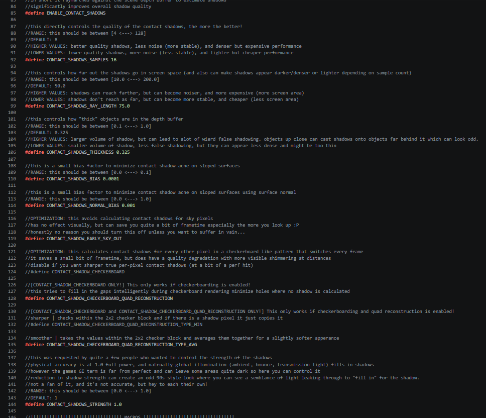
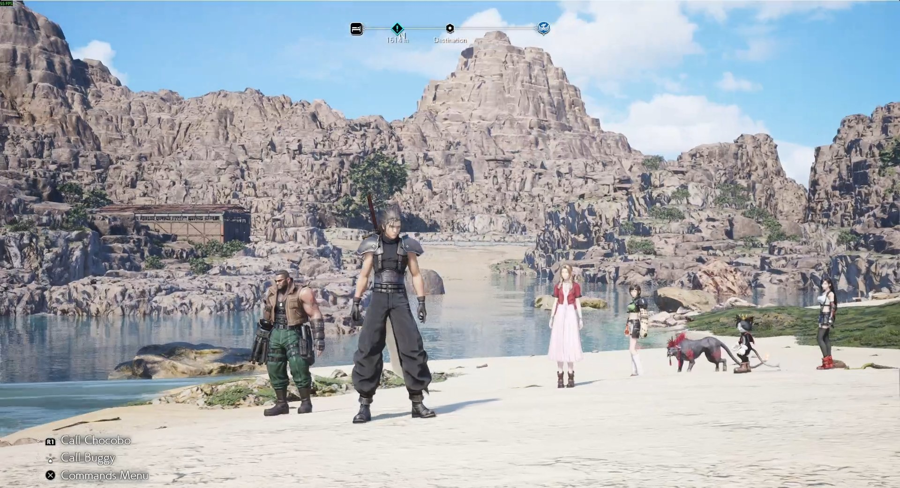
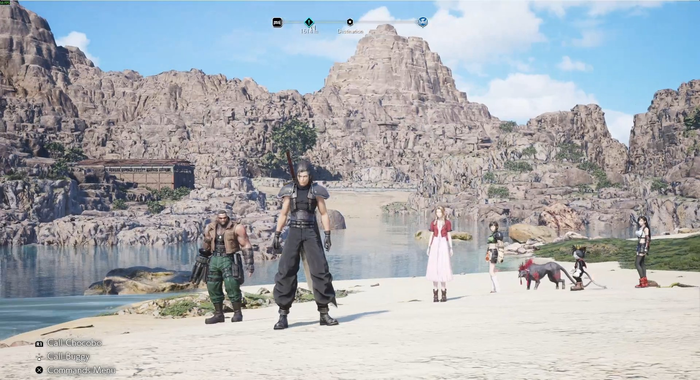
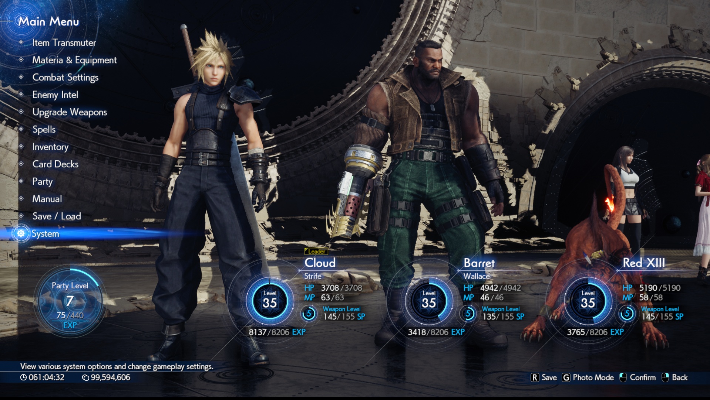
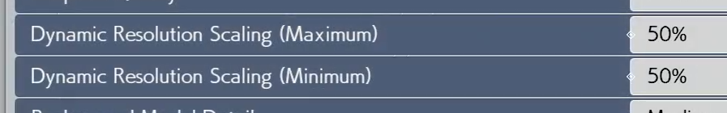
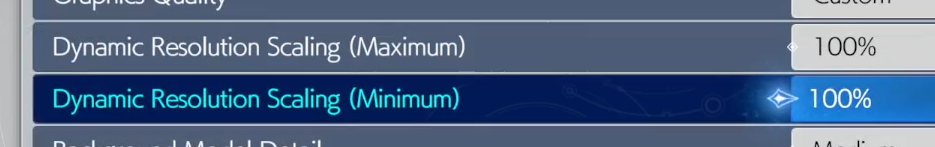

# Solutions / Fixes

This document will occasionally be updated with more information collected from Nexus, mostly from users who found solutions regarding their or others problems. I would like to quickly remind also if you continue to run into issues I would advise reporting them into [Github here](https://github.com/frostbone25/ShaderInjector/issues) as Nexus does not allow attachments of files to bug reports.

**Table of contents**
- [Lyall FF7RebirthFix](#lyall-ff7rebirthfix)
- [Reshade](#reshade)
- [Anti-Virus Shenanigans / False Positives](#anti-virus-shenanigans--false-positives)
- [Shader Adjustments](#shader-configuration-tweaking)
- [Vanishing Lights](#vanishing-lights)
- [Linux Support](#linux-support)
- [Game Not Launching](#game-not-launching)
- [HDR](#hdr)
- [Optiscalar](#optiscalar)
- [Save Error / Shader Cache Error](#save-error--shader-cache-error)
- [Image Noise / Flickering](#image-noise--flickering)

---

#### [Lyall FF7RebirthFix](https://codeberg.org/Lyall/FF7RebirthFix)

[*(Courtesy of x6800)*](https://github.com/x6800)

Lyall's mod uses the Ultimate ASI Loader as its `dsound.dll`, which automatically loads any `.asi` file it finds in the game directory. Since an `.asi` file is just a renamed `.dll`, you can rename the Shader Injector's `dsound.dll` to `ShaderInjector.asi` and let the ASI Loader pick it up.

### Steps

1. Copy the **21:9 mod's** `dsound.dll` into the game root — this is the ASI Loader.
2. Copy `FF7RebirthFix.asi` and `FF7RebirthFix.ini` into the game root as usual.
3. Rename the **Shader Injector's** `dsound.dll` to `ShaderInjector.asi` and place it in the game root.
4. Copy the `ShaderInjector/` folder into the game root as usual.

### Your game root should look like this

| File | Purpose |
|------|---------|
| `dsound.dll` | Ultimate ASI Loader |
| `FF7RebirthFix.asi` | 21:9 Fix |
| `FF7RebirthFix.ini` | Config |
| `ShaderInjector.asi` | Shader Injector (**renamed from** `dsound.dll`) |
| `ShaderInjector/` | Shader Injector resources |

Both mods should load on game start.

*(Courtesy of [Zaccachino](https://www.nexusmods.com/profile/Zaccachino))* You can also rename renaming Lyalls dsound.dll to winmm.dll allows both mods to run with each other.

---

#### [Reshade](https://reshade.me/)

ReShade reportedly is unstable for some users. Make sure that you are using the latest version, during testing myself *(using version 6.7.3)* I haven't ran into any issues/crashes with running Injector and Reshade simultaneously. 

However if you're running into issues, [Zaccachino](https://www.nexusmods.com/profile/Zaccachino) reported that you can disable ReShade during the setup process of Shader Injector ***(dragging dxgi.dll temporarily out of the game directory)***. When Shader Injector is fully setup you can go into [ShaderInjector.ini](https://github.com/frostbone25/ShaderInjector/blob/main/InjectorSettings.md) and change ```MenuOpen``` so the menu does not open anymore by default *(it helps to change the keybind to a key you might not hit)*. Then re-enable Reshade and now they should be able to co-exist.

---

#### Anti-Virus Shenanigans / False Positives

Reportedly for some users anti-virus flags dsound.dll and sometimes other parts of the mod as "severe" threats *(trojan, etc)*. **This is a false positive.** Unfortunately due to the severity level the Anti-Virus software can delete dsound.dll or some files of ShaderInjector either during installation or when booting the game. 

This can lead to a cascade of issues during the installation/setup of ShaderInjector *(most common one being that shader injector does not ever appear during the setup process)*. **You need to whitelist or disable your Anti-Virus protections** as the false actions it takes can create a whole mess of problems by deleting many of it's files. **Again, it is a false positive it is not malware**, and if you don't trust it the source code is available here on Github and you can inspect the code, or even build the mod yourself.

---

#### [Shader Adjustments](https://github.com/frostbone25/ShaderInjector/blob/main/LiveShaderEditing.md)

The shader comes with many default settings i.e. Contact Shadows, Micro Shadows, BRDF changes, and more. You can tweak or toggle any features within the shader source code HLSL files if things are not to your liking. For example some common ones are...

- Pumping the quality settings for better and more stable shadows. 
- Increasing/Decreasing Ray Length for more or shorter shadow coverage.
- Reducing thickness factor to mitigate false shadowing.
- Swapping BRDF back to game's original Lambert shading.
- Reduce Contact/Micro shadow strength.

I would suggest doing this if you spot artifacts that you may not like brought on either by default settings or different effects *(for example micro shadows is known to introduce overdarkening on some objects)*.

<p float="left">
    
</p>

***NOTE:*** *When making shader changes don't forget to Rebuild Replacement Shader to apply changes.*

---

#### Linux Support

*(Courtesy of [smackedwookiee](url=https://www.youtube.com/@SmackedWookiee))*

**1. Install directx-shader-compiler**

***For Ubuntu:***
```sudo apt update```
```sudo apt install directx-shader-compiler```

***For Arch-based distros:***
```sudo pacman -S directx-shader-compiler```

***For Fedora***
```sudo dnf install directx-shader-compiler```

**2. Clear the shader cache**

***For Steam Users:***
Click on the Settings gear
```Manage > Browse Local Files```
Go up two levels to steamapps
Navigate to the following path: ```/compatdata/2909400/pfx/drive_c/users/steamuser/My Documents/My Games/FINAL FANTASY VII REBIRTH/Saved/```
Delete the ```.ushaderprecache``` files

-***For HGL Users (not tested)***
Click on the game to open the game profile
Click on the path next to WinePrefix folder
Navigate to the following path: ```/drive_c/users/%linuxusername%/My Documents/My Games/FINAL FANTASY VII REBRITH/Saved/```
Delete the ```.ushaderprecache``` files

**3. Add the following launch options for Steam: ```WINEDLLOVERRIDES="dsound=n,b" %command%```**
or for HGL users (not tested)
Add the following Variable name to the game settings page:
Variable name: WINEDLLOVERRIDES
Value: dsound=n,b

---

#### Game Not Launching

Some uesrs have reported that when installing the ShaderInjector that the game wouldn't start. A user has reported that Windows' Smart App Control was blocking the dll from being used, and turning it off fixed it and allowed the game to run.

---

#### HDR

As of 2.0 there are some issues currently with the mod that has come to my attention. For best results until a fix is rolled out I would advise playing in SDR for now. [Your game image may become incredibly dark and very contrasted than intended](https://imgur.com/a/HKkba5E). **This is a bug and there are a number of reasons for this.** Main one being at the moment there's no HDR shader variant of "PostProcessFinal" that I have created. This means many of the image adjustments/tonemaps/auto-exposure won't apply or be usable. This should be resolved in future updates. On a similar note, if you are in SDR I'd advise checking your monitor image settings if you have image issues also. I've made all of these tweaks on calibrated SDR monitors and the mod should not crush the darks of the image so ensure your monitor is properly calibrated and not using image presets that overly punches the image more than it should. Any image adjustments can be done through "PostProcessFinal" which has [wired up parameters](https://github.com/frostbone25/ShaderInjector/blob/main/ConfigurationGuide.md) that you can use to tune the image to your liking.

#### Optiscalar

[*(Courtesy of dmorazasanchez)*](https://github.com/dmorazasanchez)

For **Optiscaler.ini**
```AllowAsync = false```
```RestoreComputeSignature = true```
```RestoreGraphicSignature = true```
```PreserveSwapChain = true```
```ModifyBufferState = false```
```SkipResizeBuffers = true```

For **ShaderInjector.ini**
```MenuOpen=false```

---

#### Save Error / Shader Cache Error

[*(Courtesy of kikyprat)*](https://www.nexusmods.com/profile/kikyprat)

For users having Saving Errors, or Shader Cache errors when first booting the game, make an exclusion for the game on windows defender.

1. Open the Start menu, type "Windows Security", and open the app.
2. Click on Virus & threat protection.
3. Under Virus & threat protection settings, click Manage settings.
4. Scroll down to the Exclusions section and click Add or remove exclusions.
5. Click + Add an exclusion and choose Folder.
6. Find and select your game's main installation folder ```...steamapps\common\FINAL FANTASY VII REBIRTH```, then click Select folder

---

#### Image Noise / Flickering

The current implmentations of the following effects...

- [```SSGI_BOUNCE_LIGHT```](https://github.com/frostbone25/ShaderInjector/blob/main/ConfigurationGuide.md#ssgi--ao)
- [```SSGI_AMBIENT_OCCLUSION```](https://github.com/frostbone25/ShaderInjector/blob/main/ConfigurationGuide.md#ssgi--ao)
- [```AUTO_EXPOSURE```](https://github.com/frostbone25/ShaderInjector/blob/main/ConfigurationGuide.md#auto-exposure)

Are still experimental, and their implementations are currently flawed due to limitations with the current injector framework. The maximum quality preset does have these effects enabled by default.

For instance with ```SSGI_BOUNCE_LIGHT``` and ```SSGI_AMBIENT_OCCLUSION``` I cannot introduce new rendering passes yet which would allow me to do downsampling/filtering to both optimize and clean up those effects for a smoother and more stable final result. Currently the game's TAA/DLSS solutions act as the only denoiser for them but they are obviously not perfect. With that said in the [configuration guide](https://github.com/frostbone25/ShaderInjector/blob/main/ConfigurationGuide.md) I have written [solutions](https://github.com/frostbone25/ShaderInjector/blob/main/ConfigurationGuide.md#ssgi--ao) that you can employ to mitigate these artifacts for a final cleaner result. My recomended order of operations for reducing noise is to go in order...

- ```SSGI_BOUNCE_LIGHT```: this currently especially in low light is a significant source of noise/fireflies. [Adjust settings or disable](https://github.com/frostbone25/ShaderInjector/blob/main/ConfigurationGuide.md#ssgi--ao).
- ```SSGI_AMBIENT_OCCLUSION```: this is noisy but it's much less prevelant than the prior, but it's current implementation can introduce noise in shadowed areas. [Adjust settings or disable](https://github.com/frostbone25/ShaderInjector/blob/main/ConfigurationGuide.md#ssgi--ao).

The ```AUTO_EXPOSURE``` also is another experimental effect, and it's current implementation is flawed. Once again due to limitations with the injector framework where it samples a grid of points in the image to get a rough average of the overall exposure to try to balance the origina image. It is slow *(and of course this will be optimized in future updates)* and it is also prone to flicker. [You can adjust the variables associated with it to reduce flickering, or just flat out disable it](https://github.com/frostbone25/ShaderInjector/blob/main/ConfigurationGuide.md#auto-exposure).

# Resolved Issues

These are issues that are already resolved, but I am keeping them around just in-case there is are some users still running into issues that should have been resolved in future updates

#### (FIXED IN 1.5.1+) Flickering Shadows / Offset Shadows

<p float="left">
    
    
</p>

*Flickering Shadows*

<p float="left">
    
</p>

*Offset Shadows*

If you are experiencing some flickering within the distance, or your shadows appear correct but they seem "shifted" either to the left or to the right this is likely due to the fact that you have **Dynamic Resolution enabled within your game settings.** 

There are a couple of ways to fix the issue. The first and simplest one is if you are using Dynamic Resolution it needs to be consistent. A quick fix is to set both your Minimum and Maximum to 50%.



The other way to fix the issue is to disable Dynamic Resolution entirely setting both the Maximum and Minimum to 100%. 



Now if you need the performance boost you can instead edit Engine.ini or use [FFVII Hook](https://www.nexusmods.com/finalfantasy7rebirth/mods/4) to natively render at a lower resolution instead using something like ```r.SetRes 1920x1080f```

---

#### (FIXED IN 2.0.0+) Vanishing Lights

For users who are experiencing light sources "vanishing" in interior spaces, if you are not a fan then I would advise disabling the shader replacement for Local Lights. 

Unfortunately this is something that is out of my control as often light sources in the game are placed inside solid objects *(that have shadow casting disabled)*. The side effect is since the mod adds precise shadowing to local lights, those light sources that were visible before now end up appearing blocked because physically... its being blocked by geometry!