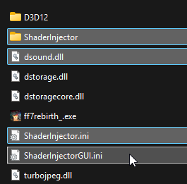
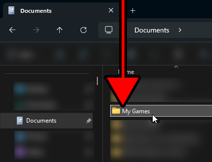
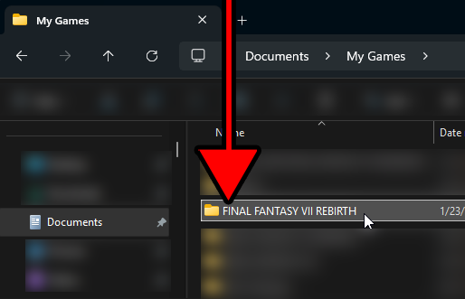
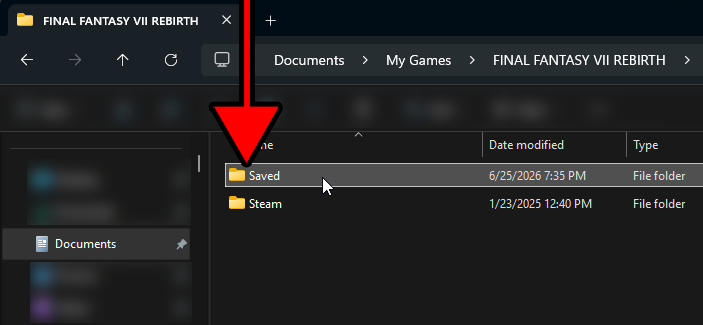
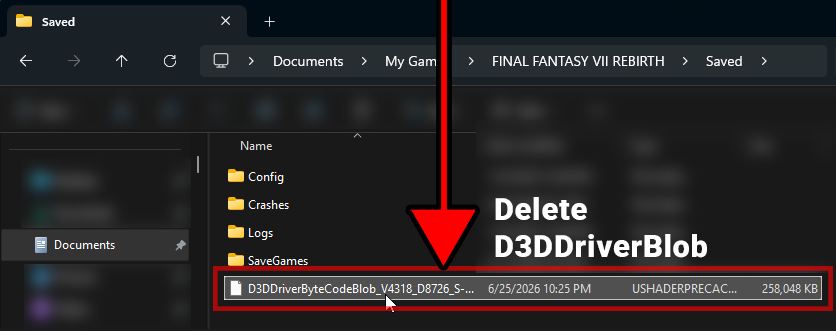
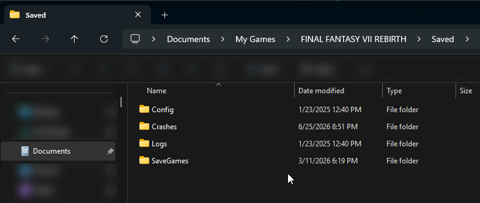

# Update Guide

For existing users who already have the mod installed and want to learn how to update...

# Updating from 1.5.1

**For users who are updating from an older version i.e. before 2.0 I highly recomend nuking the original Shader Injector installation completely.** This is so that way you can start completely clean without any residual files. So in your directory game directory delete everything...



Once you have deleted/nuked the original shader injector install you are also going to want to delete the shader cache just like you did during installation. Shader Cache for Final Fantasy 7 Rebirth is stored in this path...

```
~/Documents/My Games/FINAL FANTASY VII REBIRTH/Saved
```

<p float="left">
    
    
    
</p>

You will see a ```D3DDriverByteCodeBlob``` file, **simply delete it!**

<p float="left">
    
    
</p>

Then from here you can just simply drop in the new shader injector files into the game directory to install the mod.

<p float="left">
    
    
</p>

And you should be done! Shader Injector 2.0 automates the process of finding and creating shaders when in-game so you don't have to do any more setup.

# Updates *(2.0 or after)*

**NOTE: For the most part you do not need to rebuild the game shader cache, unless if a new shader injector update intorduces a brand new modified shader. You do not need to delete your previous Shader Targets and can keep them from before.**

Updating is simple, simply drag the contents of the new zip file to the game directory again and replace files *(You will not lose your shader targets)*.

<p float="left">
    
    
</p>

When you boot into the game the you will need to recompile the modified shaders. Just pop up the modified shaders menu and click ```Recompile All```. This will ensure that you are using the up to date compiled shader blobs.


And your done!